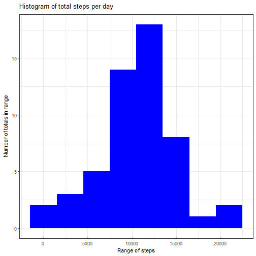
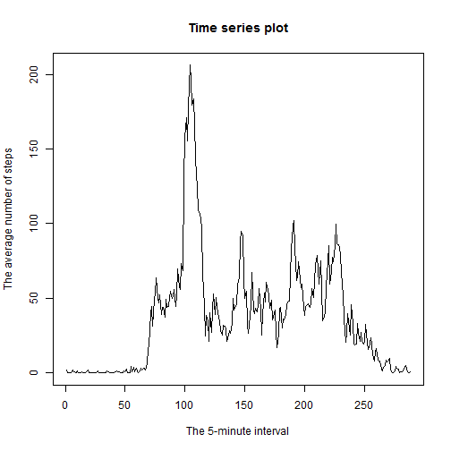
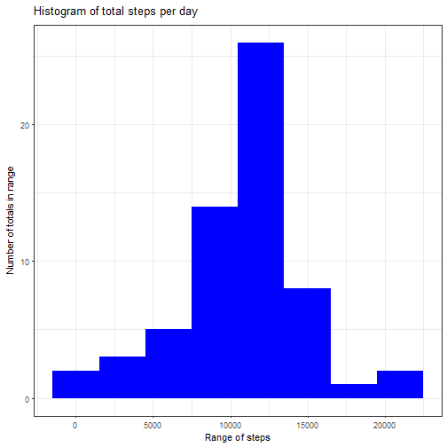
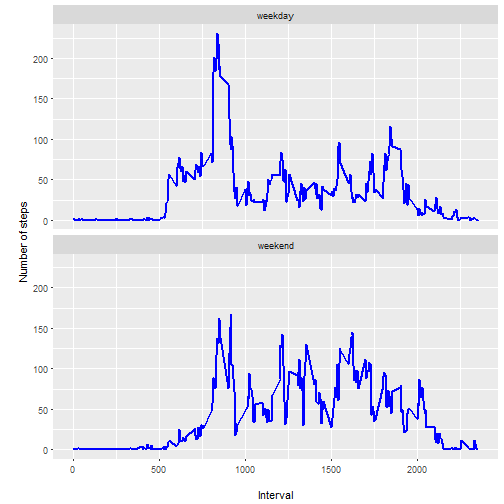

<!-- rmarkdown v1 -->

# Reproductible Research: Peer Assessment 1 

author: Ion Tecu

date: 25 December 2016

Github repository with RMarkdown source code: <https://github.com/itecu/RepData_PeerAssessment1>

## Introduction

This document presents my results for the peer assessments 1 of course Reproducible Research on Coursera. I will dive into the solutions right away.

## Prepare the R environment

First, we set echo equal to TRUE and results equal to 'hold' as global options for this document.


```r
library(knitr)
```

## Load the required libraries

We then load the required libraries for the code that will be presented afterwards.


```r
library(lubridate)
library(dplyr)
library(ggplot2)
```

## Load the required data

The following line of code reads the data.

Note: It is assumed that the file activity.csv is in the current working directory. 


```r
out<-read.csv("activity.csv")
```

## Tidy the data

We transform the column date in Date format.


```r
out$date<-ymd(out$date)
```

## What is mean total number of steps taken per day?

Next we will create a histogram of the total number of steps per day.


```r
steps_per_day<-aggregate(steps ~ date,out,sum)
ggplot(steps_per_day,aes(x = steps))+geom_histogram(fill = "blue", binwidth = 3000) + 
   theme_bw() + labs(x="Range of steps", y=expression("Number of totals in range")) + 
  labs(title=expression("Histogram of total steps per day"))
```




Now we calculate the mean and median of the number of steps taken per day.


```r
fac<-factor(out$date)
mean(tapply(out$steps,fac,sum),na.rm=TRUE)
```

```
## [1] 10766.19
```

```r
median(tapply(out$steps,fac,sum),na.rm=TRUE)
```

```
## [1] 10765
```

## What is the average daily activity pattern?

The average daily activity pattern can be seen in the following plot.


```r
mean_interval<-tapply(out$steps,factor(out$interval),mean,na.rm = TRUE)
plot(mean_interval, type = "l", main = "Time series plot", xlab = "The 5-minute interval", 
     ylab = "The average number of steps")
```




Now, we find the 5-minute interval wich contains the maximum number of steps:


```r
mean_interval[which.max(mean_interval)]
```

```
##      835 
## 206.1698
```


The highest average number of steps was found in interval 835 and had the value 206.1698.

## Imputing missing values

Now let's see if we have missing values.


```r
stepsNA <- sum(is.na(out$steps))
dateNA <- sum(is.na(out$date))
intervalNA <- sum(is.na(out$interval))
stepsNA
```

```
## [1] 2304
```

```r
dateNA
```

```
## [1] 0
```

```r
intervalNA
```

```
## [1] 0
```

Yes we do.

## Strategy for filling in all of the missing values in the dataset

We fill the missing values with the average of the coresponding 5 min interval.


```r
out_repl<-out
out_repl[is.na(out_repl$steps),]$steps<-unname(mean_interval[as.character(out_repl
      [is.na(out_repl$steps),]$interval)])
```

Check for missing values


```r
sum(is.na(out_repl$steps))
```

```
## [1] 0
```
 
And now there are no missing values.

## A histogram of the total number of steps taken each day

The code here is similar with the one above.


```r
steps_per_day_repl<-aggregate(steps ~ date,out_repl,sum)
ggplot(steps_per_day_repl,aes(x = steps))+geom_histogram(fill = "blue", binwidth = 3000) + 
  theme_bw() + labs(x="Range of steps", y=expression("Number of totals in range")) + 
  labs(title=expression("Histogram of total steps per day"))
```



But now we can see that the values are bigger because of the missing values but the shape is similar.

## What is the new mean of the total number of steps taken per day?

We redo the calculations for the mean and median.


```r
fac_repl<-factor(out_repl$date)
mean(tapply(out_repl$steps,fac_repl,sum),na.rm=TRUE)
```

```
## [1] 10766.19
```

```r
median(tapply(out_repl$steps,fac_repl,sum),na.rm=TRUE)
```

```
## [1] 10766.19
```


## Do these values differ from the estimates from the first part of the assignment?

As we can see the median is different from the one above.

## What is the impact of imputing missing data on the estimates of the total daily number of steps?

Because we filled the missing values in this way we expected this result.The difference between the mean and the median was insignificant anyway.

## Are there differences in activity patterns between weekdays and weekends?

We can plot the data and see what we get.


```r
out_repl<-mutate(out_repl,weekdaytype = sapply(date,function(x) if (weekdays(x) %in% 
        c("Saturday","Sunday")) "weekend" else "weekday"))
mean_interval_repl<-aggregate(steps ~ interval + weekdaytype, out_repl, FUN=mean)
ggplot(mean_interval_repl, aes(x=interval, y=steps)) + 
  geom_line(color="blue", size=1) + 
  facet_wrap(~weekdaytype, nrow=2) +
  labs(x="\nInterval", y="\nNumber of steps")
```



As we can see from the plots it seems that in the weekend we are moving a little more during the day compared with the weekdays when we are moving more in the morning and less during the day because that's the period when we go to work.This plots are confirming what we've expected from the data.


